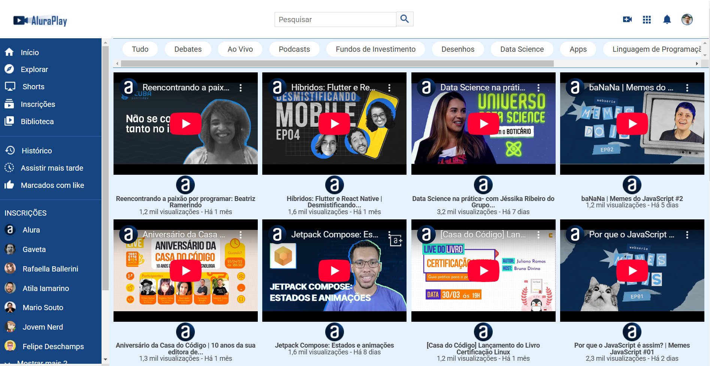

# AluraPlay

## ℹ️ Sobre

Projeto utilizado no curso para aprendizado das técnicas e melhores práticas.

## 📘Ementa

### CSS: Flexbox e layouts responsivos

- Aprender a utilizar propriedades do Flexbox na prática construindo um projeto responsivo
- Alterar o eixo de itens para horizontal ou vertical
- Aplicar vídeos de forma responsiva utilizando propriedades Flexbox
- Conhecer as características do Flexbox
- Integrar as propriedades Flexbox com outras propriedades CSS

## 🖥️ Tecnologias

  
  

## 🧑‍🏫 Instrutor(es)

| [ Mônica Hillman](https://www.linkedin.com/in/luanalvesdev/) |
| :-------------------------------------------------------------------------------------------------------------------------------------------------------------------------------------------------------------------------------------------------------------------------------------------------------------------------------: |

## 💻 Screenshot

  
